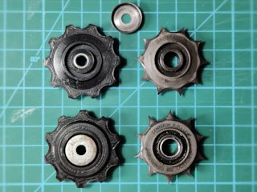
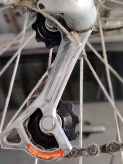
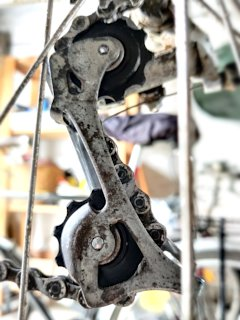

# Derailleur 10-tooth pulleys (Shimano compatible)
*3D printable pulleys/jockey wheels for RD-MC12 and similar derailleurs*

### License
[Creative Commons - Attribution](https://creativecommons.org/licenses/by/4.0/)

### Gallery

[🔎](images/photo1.jpg) [🔎](images/photo2.jpg) [🔎](images/photo3.jpg)

## Description and Instructions

If you have a bike with an old RD-MC12 or similar Shimano derailleur, finding spare pulleys (jockey wheels) proves to be difficult. You could buy the Tourney Y56398100 set which is reasonably compatible, but it has 2 identical wheels while on the MC12 there is an actual difference between the guide and tension pulleys. The guide pulley (or G-pulley) is slightly thinner to offer extra horizontal movement. (They also have different shapes but I believe this is only to easily tell them apart.) Sure, one could sand down one of the Tourney wheels, but if you happen to have a 3D printer anyhow, why not simply print the correct wheels and be entirely independent of the supply chain?

The models provided here are fairly accurate replicas of the now elusive spare parts:
* *Y5UF98050:* guide pulley (upper)
* *Y5UF98060:* tension pulley (lower)

You will need to reuse the bushings and end caps of your old pulleys, or you could buy a set of the Tourney pulleys to obtain those parts, assuming they have that exact size (not checked). The bushings must have a diameter of 8 mm and a length of 9.25 mm.

To make swapping the pulleys easy, shift to the smallest chainwheels both front and back, to have minimal tension on the chain while unscrewing the pulley bolts.

### Printing

PETG is a great material for these, because it is tough and resistant to wear. PLA could work too, but will probably wear faster. Tougher PLA variants like PLA Plus would be preferred over regular PLA. I wouldn't use ABS because it wears easily. Polycarbonate is probably also a great material, if you have the means to print it. Resin could also work well.

You could print the pulleys as a whole by relying on supports, but it makes more sense to print them in 2 halves and then glue these together. This yields the highest quality, allows to fine-tune the thickness by sanding the halves before gluing, and avoids the hassle of supports.

Print in 0.1 mm layers for accuracy. 100% infill is recommended.

### Post-Printing

If you printed the pulleys as two halves, make sure the inside surfaces fit together nicely. Sand them if your print bed isn't perfectly flat, or if the pulleys would be too thick due to an inaccurate first layer. The G-pulley should be 8.65 mm thick, the tension pulley 9.00 mm. Give the surfaces a final pass with coarse sandpaper, so the glue has something to catch onto. I used epoxy as glue.

The hole in the models has a diameter of 8.1 mm which matches the real wheels, but pretty much every 3D printer, no matter how well calibrated, will print these holes with a slightly smaller diameter. This is actually not a bad thing and it is better to ream the slightly too small holes to obtain the correct diameter, than to try to print them directly at the exact diameter. Reaming the holes will yield a smooth bearing surface that will wear more slowly than a ‘perfectly’ printed surface that is rough due to layer artefacts. Moreover, if you glue two half pulleys together, you need to ream the hole anyway to remove excess glue.\
I used an 8 mm drill bit slathered with scouring agent (like Cif), to speed up the reaming action which would otherwise have taken ages due to the toughness of PETG. Keep reaming until the bushings just fit in the holes and the pulleys can spin freely.

## Disclaimer

These 3D models are not endorsed by Shimano and come without any warranties or claims for fitness for any purpose. Use at your own risk. You can sell prints of these models, but it must be clear that your prints are not Shimano parts. (If you sell prints, this should be obvious anyhow because you must honor the CC-BY license by including a link to this GitHub source page with each sold object.)

## Tags
`Shimano`, `RD-MC12`, `pulley`, `jockey`, `derailleur`, `cog`, `gear`
